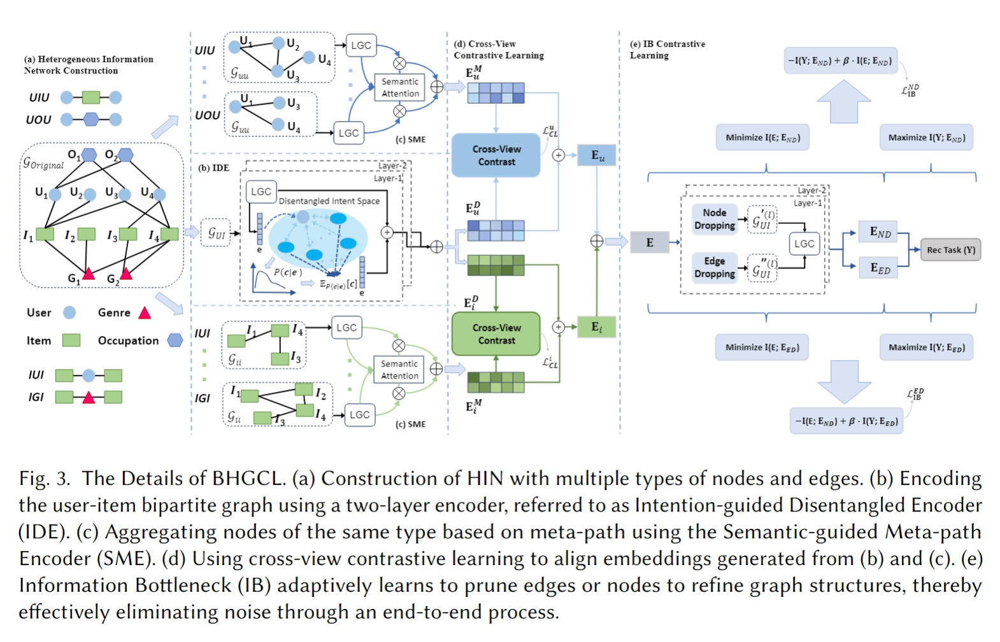
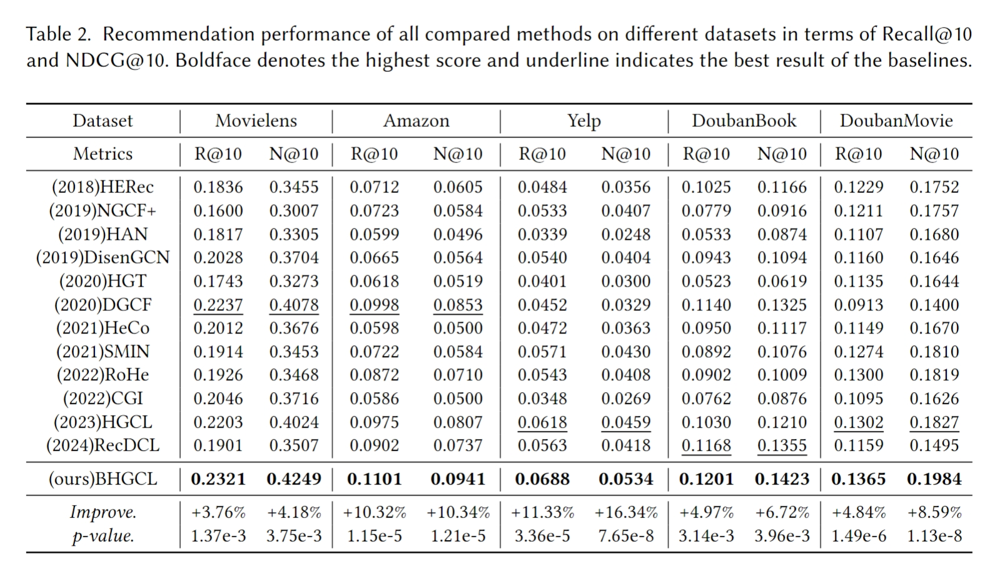

# BHGCL: Bottleneced Heterogeneous Graph Contrastive Learning for Robust Recommendation
## Model Overview



## Requirements
python==3.9.18
torch==1.12.0
dgl==1.1.2
cuda==116

### Others
```python
pip install -r requirement.txt
```

## Usage
```python
python main_recdcl.py --walk_length 20 --lr 0.001 --dataset Yelp --gpu 0 --num_workers 12 --batch 10240 --cl_rate 0.09 --IB_rate 0.0002
```


## Experiment results



## Datasets
Get the datasets from [https://drive.google.com/drive/folders/12NpEY1Z6Ua_-GgN7ChliP98SvzNZ9Paw?usp=drive_link](https://drive.google.com/drive/folders/12NpEY1Z6Ua_-GgN7ChliP98SvzNZ9Paw?usp=drive_link)


## Acknowledgement
Our work draws inspiration from two excellent works: [DCCF](github.com/HKUDS/DCCF) and [CGI](github.com/weicy15/CGI).
Thanks for their sharing and contribution.


